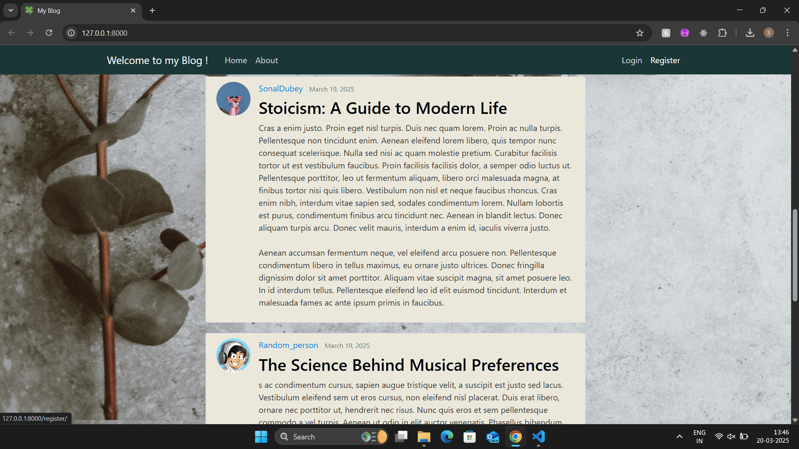
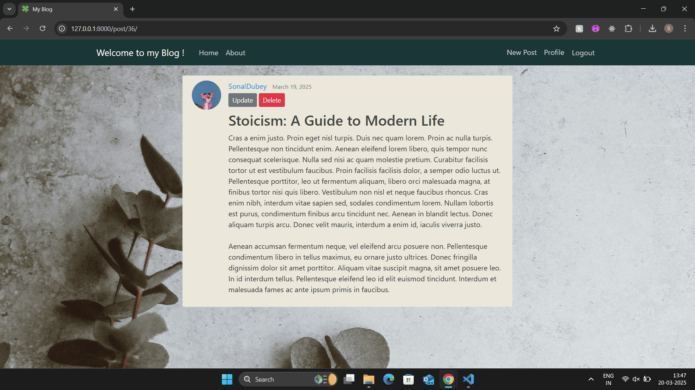
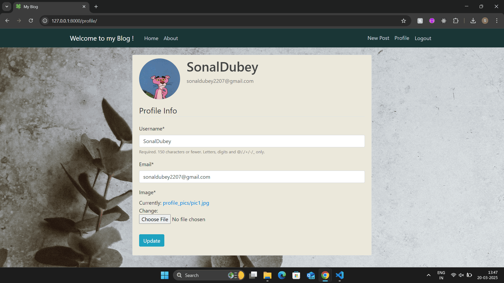
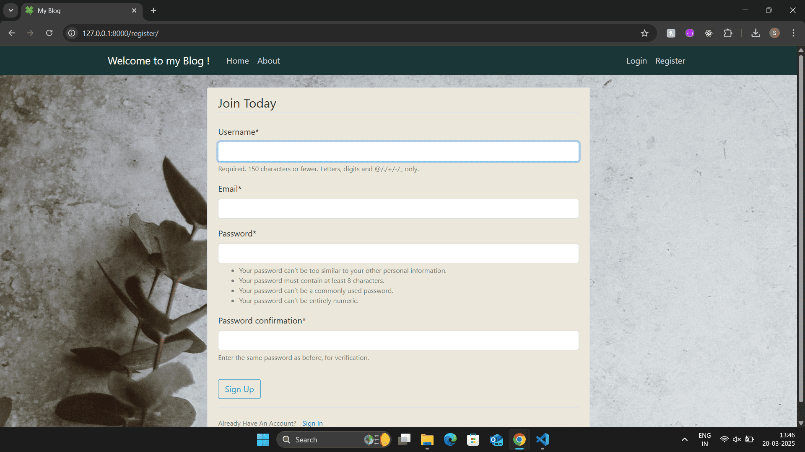
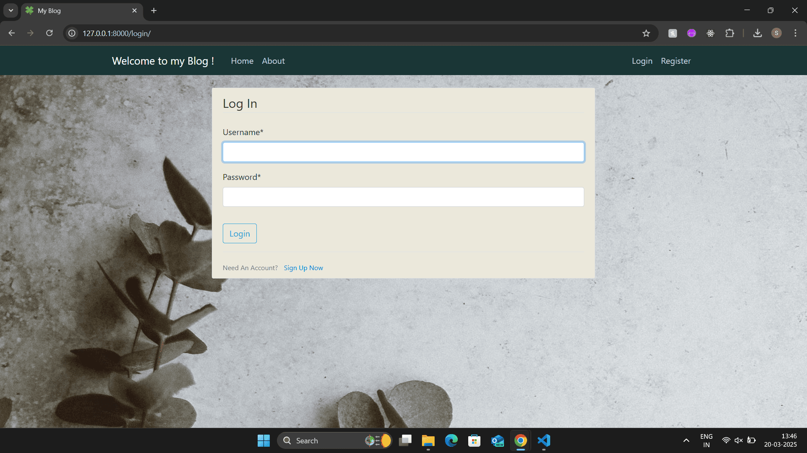

# Django Blog Application







## 📌 Overview
This is a **full-featured blog application** built using **Django, HTML, CSS, Bootstrap, and SQLite**. It allows users to create and manage their own blog posts while providing a clean and user-friendly interface with authentication, profile management, and pagination.

## 🚀 Features

### 🔑 Authentication & User Management
- Register new users (**Django Signals** automatically create their profiles).
- Login & Logout functionality.
- Update user credentials & profile image.
- Profile images are resized if a large file is uploaded.

### 📝 Blog Functionality
- **Create, Update, and Delete** posts (only by the post owner).
- Home page displays **all posts by all users**.
- Clicking on a post by another user shows the **post detail view** only.
- Clicking on your own post shows **edit & delete options**.
- Clicking on a username filters all posts by that user.

### 🎨 UI & Navigation
- Pagination: At most **5 posts per page**.
- **Bootstrap-based** responsive design.

### 🏗️ Implementation Details
- Uses **Class-Based Views (CBVs) & Function-Based Views (FBVs)**.
- **Django Signals** for profile creation.
- **SQLite** as the database.

## 🛠️ Installation & Setup
1. **Clone the Repository**
   ```sh
   git clone https://github.com/your-username/django-blog.git
   cd django-blog
   ```
2. **Create a Virtual Environment & Activate it**
   ```sh
   python -m venv venv
   source venv/bin/activate  # On Windows: venv\Scripts\activate
   ```
3. **Install Dependencies**
   ```sh
   pip install -r requirements.txt
   ```
4. **Apply Migrations**
   ```sh
   python manage.py migrate
   ```
5. **Create a Superuser (Optional, for Admin Panel Access)**
   ```sh
   python manage.py createsuperuser
   ```
6. **Run the Development Server**
   ```sh
   python manage.py runserver
   ```
7. Open **http://127.0.0.1:8000/** in your browser.

## 📷 Screenshots
- Homepage (`screenshots/homepage.png`)
- Post Detail (`screenshots/post_detail.png`)
- User Profile (`screenshots/user_profile.png`)
- Update Post (`screenshots/update_post.png`)

## 📜 License
This project is licensed under the MIT License - see the [LICENSE](LICENSE) file for details.

## 📬 Contact
For any queries, reach out at **sonaldubey2207@gmail.com** or connect on **[LinkedIn](https://www.linkedin.com/in/sonal-dubey-58a410198/)**.
